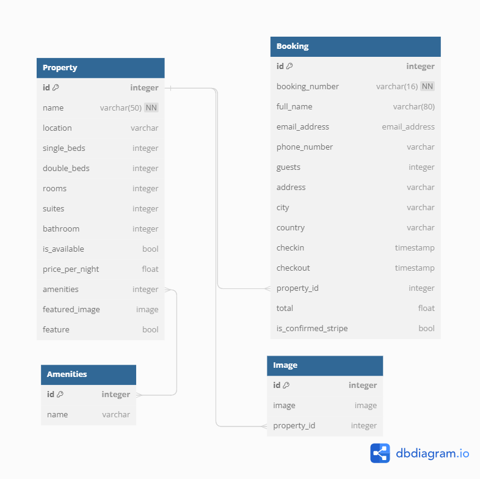
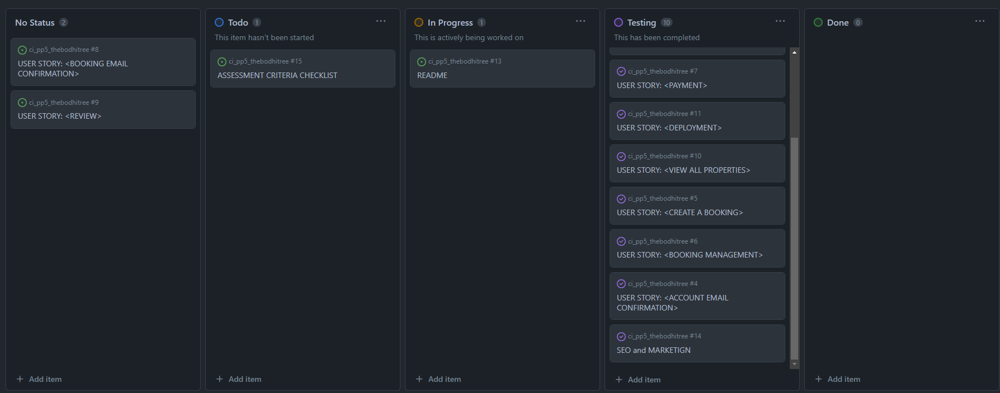

# THE BODHI TREE

## Nature Retreats

[Visit the live webpage](https://the-bodhi-tree-b9b27b51f217.herokuapp.com/)

## Table of Content

- [Project Overview](#project-overview)
    - [Project Goals](#project-goals)
    - [User Stories](#user-stories)
- [Design](#design)
    - [Wireframes](#wireframes)
    - [Data Model](#data-model)
    - [Agile Methodology](#agile-methodology)

## Project Overview

### Project Goals

The Bodhi Tree is a Nature Retreats chain where guests can enjoy nature and peace of mind while staying at beautiful properties in many different locations.

Users of the website can easily navigate to see all the properties available and all their details. They can book and pay for a stay and also manage their booking after it has been confirmed.

### User Stories

GitHub Issues was used to document the User Stories used to develop the website.

- Navigation
    - As a user I can view a landing page with a list of properties so that I can see what the business offer.
    - As a user I can view all the details of the accomodation so that I can see all of the informaiton available and make a sound decision for booking a stay.
    - As a user I can see a list of all the properties so that I can see what more the website has to offer.
- Account/User Authentication
    - As a user I can register for a new account, log in and log out so I can access and manage my bookings.
    - As a user creating a new account I can receive an email confirmation so that I can confirm the creation of my account and access and manage my bookings.
- Booking
    - As a user I can create a booking for an accomodation sothat I can book a stay at the desired accommodation on the desired dates.
    - As a user I can pay for a booking so that I can confirm and save the booking information.
    - As a user who has booked a stay I can retrieve my booking so that I can view, edit or cancel my booking.
- Deployment
    - As a user I can access the website so that I can use all of it's features.

## Design

### Wireframes

The bellow wireframes were created for designing the website main pages, which are the home page and the event detail page. The website is responsive and works well with most screens sizes, mobile and lapatops layout were prioritized.

All other pages were built on top of the main page desgin without need for other wireframes.

### Data Models

The below diagram illustrates the data models initially idealized for the project. Slight alterations were made to the actual data models during development. The Image model was initially idealized to be used as a library for images to be displayed at a property details page, this will be implemented at a future release.

### Agile Methodology

Github Projects Kanban Board and GitHub Issues was used to document project development. Milestones were created to record development iterations with relevant prioritization.

