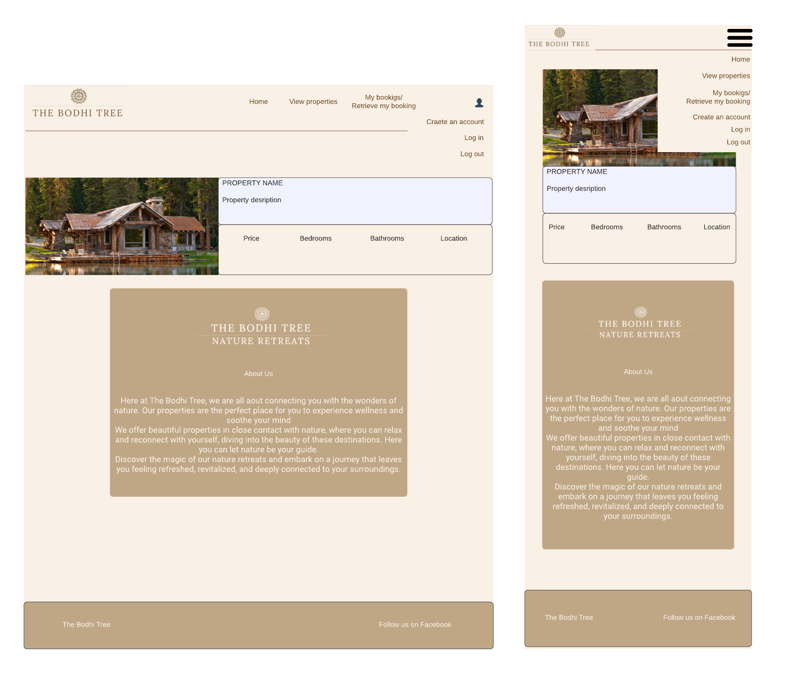
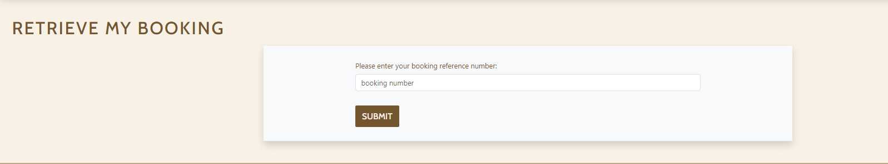
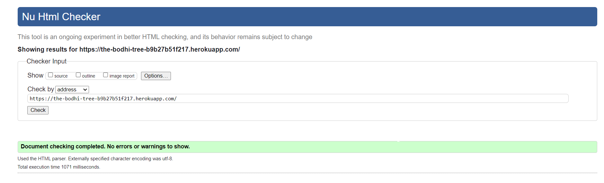

# THE BODHI TREE

## Nature Retreats

[Visit the live webpage](https://the-bodhi-tree-b9b27b51f217.herokuapp.com/)

## Table of Content

- [Project Overview](#project-overview)
    - [Project Goals](#project-goals)
    - [User Stories](#user-stories)
- [Design](#design)
    - [Wireframes](#wireframes)
    - [Data Model](#data-model)
    - [Agile Methodology](#agile-methodology)
- [Technologies](#technologies)
    - [Languages](#languages)
    - [Frameworks, Libraries, Softwares and Services](#frameworks-libraries-softwares-and-services)
- [Features](#features)
    - [Home Page, Navigation and Authentication](#home-page-navigation-and-authentication)
    - [View All Properties](#view-all-properties)
    - [Property Details](#property-details)
    - [Creating a Booking and Booking Management](#creating-a-booking-and-booking-management)
- [Future Features and Improvements](#future-features-and-improvements)
- [Validation](#validation)
    - [HTML Validation](#html-validation)
    - [CSS Validation](#css-validation)
    - [Lighthouse](#lighthouse)
    - [Python PEP8 Validation](#python-pep8-validation)
- [Deployment](#deployment)
    - [Heroku](#heroku)
- [Bugs](#bugs)
- [Credits](#credits)

## Project Overview

### Project Goals

The Bodhi Tree is a Nature Retreats chain where guests can enjoy nature and peace of mind while staying at beautiful properties in many different locations.

Users of the website can easily navigate to see all the properties available and all their details. They can book and pay for a stay and also manage their booking after it has been confirmed.

### User Stories

GitHub Issues was used to document the User Stories used to develop the website.

- Navigation
    - As a user I can view a landing page with a list of properties so that I can see what the business offer.
    - As a user I can view all the details of the accomodation so that I can see all of the informaiton available and make a sound decision for booking a stay.
    - As a user I can see a list of all the properties so that I can see what more the website has to offer.
- Account/User Authentication
    - As a user I can register for a new account, log in and log out so I can access and manage my bookings.
    - As a user creating a new account I can receive an email confirmation so that I can confirm the creation of my account and access and manage my bookings.
- Booking
    - As a user I can create a booking for an accomodation sothat I can book a stay at the desired accommodation on the desired dates.
    - As a user I can pay for a booking so that I can confirm and save the booking information.
    - As a user who has booked a stay I can retrieve my booking so that I can view, edit or cancel my booking.
- Deployment
    - As a user I can access the website so that I can use all of it's features.

## Design

### Wireframes

The bellow wireframes were created for designing the website main pages, which are the home page and the event detail page. The website is responsive and works well with most screens sizes, mobile and lapatops layout were prioritized.

All other pages were built on top of the main page desgin without need for other wireframes.



### Data Models

The below diagram illustrates the data models initially idealized for the project. Slight alterations were made to the actual data models during development. The Image model was initially idealized to be used as a library for images to be displayed at a property details page, this will be implemented at a future release.


### Agile Methodology

Github Projects Kanban Board and GitHub Issues was used to document project development. Milestones were created to record development iterations with relevant prioritization.


## Technologies

### Languages

- HTML5
- CSS3
- Python

### Frameworks, Libraries, Softwares and Services

- Django
- Amazon AWS
- Stripe Payment
- Mailchimp
- Django Crispy Forms
- Elephant SQL
- Boostrap 5
- Lucid Charts
- PostgreSQL
- Gunicorn
- Heroku
- Git
- GitHub
- Font Awesome
- Google Fonts
- dbdiagram.io

## Features

### Home Page, Navigation and Authentication

The navigation bar consists of a logo that act as a link back to the home page and a navigation menu collapsable into a hamburger menu on mobile phones. the navigation menu has different options that depends on an user being authenticated or not.

The links on the navigation menu can be used to access the home page, to view all properties and to view the user's bookings if they are authenticated or access the booking retrieval form otherwise.

Through the navigation menu the user can also create a new account, or log in/out of their existing one.

The first section of the home page lists the featured properties. These are properties that the site owner would like to give priority to be advertised.

The home page also contains an about us section, where the user can get to know more about the business and a form where the user can enter their email to subscribe to a newsletter, in order to keep up to date with promotions or information surrouding, meditation, mindfullness, nature among other things.


### View All Properties

In this page the user can view a list of all available properties. Each property information card works as a link to the property details page.


### Property Details

Here the user can find out more about the property with a more complete description and more information about the amenities. This is also where the property library will be displayed at a future implementation.

This page also contains a button to take the user to the form that will allow them to make a reservation.


### Creating a Booking and Booking Management

For creating a booking the user must submit a form with the following information.

- Full Name
- Email Address
- Phone Number
- Address
- City
- Country
- Checkin and Checkout Dates
- Number of Guests


Upon successfull submission of the form, the user is redirected to the stripe payment page where they can pay for their booking.


After the successful payment, the user is then redirected to the booking details page, where they can confirm the booking details and also edit or cancel their booking.


If the user is authenticated, the created booking will be saved to their account and can be accessed through the My Bookings link in the navigation menu. Otherwise, the user can also view their booking, by using the retrieved my booking link, by entering their booking reference number.



## Future Features and Improvements

The future features and improvements already idealized for the website:

- Allow users to give reviews about the properties and display these on the property details page.
- Add more images in the format of a library, so the user can have a better idea of what the property looks like.
- Implement a scheduling system so properties cannot be double booked for the same dates. At the moment there is no feature to block this from happening.
- Implement security features that creates a booking only upon successfull payment. Currently, the booking is created upon submission of the form and before payment is concluded.
- Send email confirmation upon booking confirmation so user can be guaranteed to receive all booking information in case the booking confirmation page is not presented to the user.
- Display total price on booking form page, so user can see the full price before submitting the form.

## Validation

### HTML Validation

After fixing a few errors such as wrong closing tags and invalid tags, all pages passed W3C HTML validation.



### CSS Validation

Custom CSS was validated using W3C CSS Validator and passed with no issues


### Lighthouse

A good performance of Lighthouse validator was observed for Accessibility, Best Practices and SEO, however images could be better sized to improve overall performance.

 

 ### Python PEP8 Validation

 PEPE8 was followed for writting python code. The [CI PEP8 linter](https://pep8ci.herokuapp.com/) was used on all python files in the prject and no errors were found with the exception of settings.py which contain autogenerated code from Django that was not modified to comply with PEP8.

 ## Deployment

### Heroku

- On local environment, add list of dependencies by using the command:

```console
pip3 freeze --local > requirements.txt
```

- Create a Procfile on your project root directory with the following code, replacing 'project_name' according to your project name:

```
web: gunicorn project_name.wsgi
```

- Add HEROKU_APP to ALLOWED_HOSTS in settings.py.

- Push changes to github.

- On Heroku create a new app, chosing a name and selection your region.

- On the Settings tab, select "Reveal Config Vars" and add the following config vars:

    - AWS_ACCESS_KEY_ID: Amazon AWS access key ID
    - AWS_SECRET_ACCESS_KEY: Amazon AWS Secret Access Key
    - DATABASE_URL: Elephant SQL database url. Documentation can be found [here](https://www.elephantsql.com/docs/)
    - EMAIL_HOST_USER: Host email for sending confirmation emails
    - EMAIL_HOST_PASSWORD: Host email password for sending confirmation emails
    - SECRET_KEY : Django secret key which can be generated [here](https://miniwebtool.com/django-secret-key-generator/)
    - STRIPE_SECRET_KEY: Stripe Secret Key for performing payments.

- On the Deploy tab select GitHub as the Deployment Method.

- Search for your repository and click connect

- Click Enable Automatic Deploys if you wish to allow a new deployment everytime code is pushed to your GitHub repository.

- Click on Deploy Branch.

- Once deployed click on View to open the deployed website.

### Forking, Creating a Local Clone and Setting Up Local Environment

- Login to GitHub and navigate to the project [repository](https://github.com/felipesandoli/ci_pp5_thebodhitree)

- On the top of the page click on Fork and a copy of the repository will be made to your profile.

- On your forked repository click on the Code dropdown, select HTTPS and copy the repository url.

- On your chose command line interface navigate to your working directory and type `git clone` and pasting the copied repository url

- Create a virtual enviroment with:
 ```
 python3 -m venv env_name
 ```

 - Activate your local environment and install dependencies:

 ```
 pip3 install -r requirements.txt
 ```

 - Create a env.py file, adding it to .gitigonre and set the above mentioned config vars as environment variables.

 ## Bugs

 There is a bug where if the user try to make a booking for a long enough period of time, the booking price will increase significantly resulting in an error when proceeding to payment. This is probably an issue with Stripe payment. Further investigation is needed and a fix will be implemented at a later release.

 ## Credits

 - Shinrin Yoku cover image: photo by [Pixabay](https://www.pexels.com/photo/view-of-building-exterior-327483/)
 - Villa Lucinda cover image: photo by [David Bartus](https://www.pexels.com/photo/potter-plants-on-stairs-of-building-1509803/)
 - Gudmundur's Cabin cover image: photo by [Michal Prucha](https://unsplash.com/photos/qVKLnAbqZ_0?utm_source=unsplash&utm_medium=referral&utm_content=creditShareLink)
 - Datepicker: [Stack Overflow](https://stackoverflow.com/questions/3367091/whats-the-cleanest-simplest-to-get-running-datepicker-in-django)